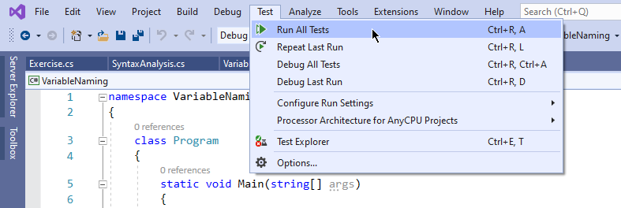
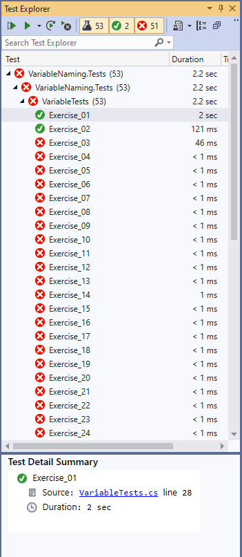

# Variables and Data Types

For this exercise, you'll need to provide a response to each of the fifty-three word problems defined in the code.

Your goal is to create the appropriate variables with the correct data types, assign values to the variables, and specify the correct operators needed to provide the expected answer.

## Learning objectives

After completing this exercise, you'll understand:

* Variable declaration, including
    * Good variable names
    * Appropriate data types
* Variable assignment
* How to use variables, literals, and operators within arithmetic expressions

## Evaluation criteria and functional requirements

Your work will be evaluated based on the following criteria:

* The project compiles without build errors.
* Variables are named appropriately, with good, meaningful names.
* Data types for variables are appropriate based on the value that will be assigned to the variable.
* The expected result is the last line and is correct for each task.
* Unit tests pass as expected.

## How to run unit tests

Many of the exercises you work on during the cohort will have **unit tests** associated with them.

Unit tests are an important component of software development. They test small pieces of code that should have repeatable and expected results. The unit tests associated with your exercises will help you verify that you completed the necessary work.

You'll learn how to write your own unit tests later in the cohort, but for now, you need to know how to run them. Complete the following steps:

1. Click on the **Test > Run All Tests** menu.

    

2. Click on the **Test Explorer** tab to see the results of your tests and which ones passed or failed.

    

> Note: the first two exercise tests are passing since the code is provided for them.
## Getting started

1. Open the `variables-and-datatypes-exercises.sln` file in Visual Studio.
2. Open the `Program.cs` file that's in the `VariableNaming` project.
3. Make sure the project builds.
4. Begin working on the exercise by adding the necessary code below each question. An example is included below.

### Example

#### Problem

*There are four squirrels, and sixteen acorns. Assuming squirrels have a sense of fairness, how many acorns will each squirrel receive?*

#### Solution

```csharp
int acorns = 16;
int squirrels = 4;
int sharePerSquirrel = acorns / squirrels; //expected result
```

### Tips and tricks

#### Choose good variable names

One of the [hardest things about programming is choosing good names][naming-things-is-hard]. Focus on finding good, meaningful, and descriptive names for your variables.

Clarity and expressiveness are more important than brevity. Err on the side of longer, more descriptive names over short, cryptic ones.

Try this: when you're naming your variables, read them out loud. Do they read like a sentence? If you read them to another person, can they understand what you're saying? If not, keep working on the names of your variables.

*Remember that variables should be camelCase in C#.*

#### Be consistent with your choice of data types

It's important to be consistent with the data types you use, especially when it comes to some values like money. There are many different ways to express money. *Pick one data type and stick with it throughout these exercises.*

#### Write clean code

*Keep your code consistent and well formatted.* When code is poorly indented, or lost in a flood of blank lines, it can be difficult to read.

#### Don't linger too long on one problem

If you find yourself stuck on a problem more than fifteen minutes, move on to the next, and try again later. You may figure out the solution after working through another problem or two.

#### Don't forget to commit

As you're working through problems, it's a good idea to *commit early and often*. This means that once you've written enough code to complete a task, you should add your changes and commit them.

Work on getting into the habit of writing [good commit messages][good-commit-messages].

---

[good-commit-messages]: https://chris.beams.io/posts/git-commit/
[naming-things-is-hard]: https://hilton.org.uk/blog/why-naming-things-is-hard
